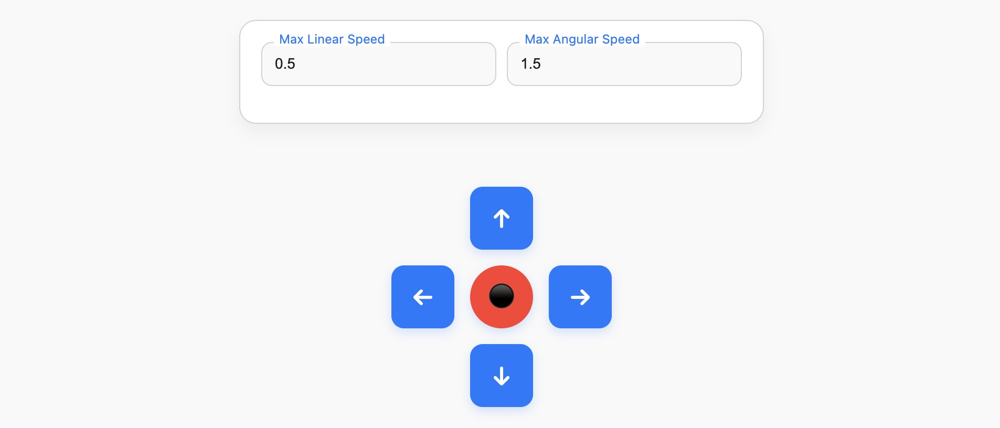
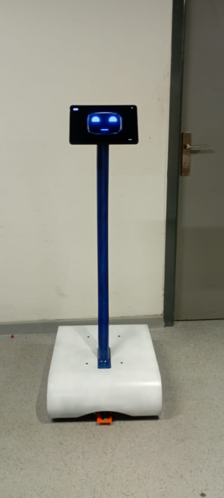

# 🤖 Telepresence Robot Control Panel (ROS + WebSockets + WebRTC)

> A browser-based control interface for navigating a ROS-powered telepresence robot remotely using WebSockets, ROSBridge, and WebRTC video streaming.

---

## 📽️ Demo Videos

| Type | Preview | Link |
|------|---------|------|
| 📍 **Real Robot Navigation** | [🎥 Watch Demo](./Teleop/robot%20movement.mp4) |
| 🗺️ **Map Navigation View** | [](https://youtube.com/watch?v=YOUR_MAP_VIDEO_ID) |

> ⚠️ *Replace the YouTube IDs with your actual video links.*

---

## 📸 Screenshots

### 🔄 Robot Moving in Map (Web Interface)
 <!-- Replace this -->


### 🤖 T-Bot
 <!-- Replace this -->

---

## 🚀 Features

- 🔄 Real-time control of the robot using ROS topics (`/cmd_vel`, `/goal`, `/odom`)
- 🗺️ Map-based goal navigation interface
- 📡 Live camera feed from the tablet using WebRTC
- 🌐 WebSocket communication between frontend, Node.js server, and ROSBridge

---

## 🛠️ Tech Stack

- **Frontend**: HTML, CSS ,JavaScript (Canvas)
- **Backend**: Node.js (WebSocket server)
- **Robot Middleware**: ROS 2 + ROSBridge
- **Communication**: `roslibjs`, `rosnodejs`, WebSockets
- **Streaming**: IP Webcam

---

## 🧠 System Architecture

```mermaid
graph TD
    A[Browser UI] -->|WebSocket| B[Node.js Server]
    B -->|rosnodejs / roslibjs| C[ROSBridge WebSocket Server]
    B -->|WebRTC / WebSocket| D[Tablet Camera Feed]
    C --> E["Robot Topics:/cmd_vel\n/odom\n/goal"]
